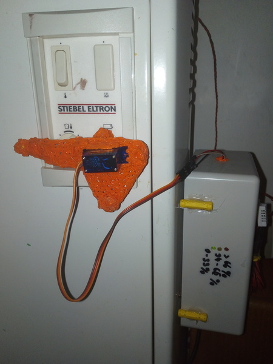
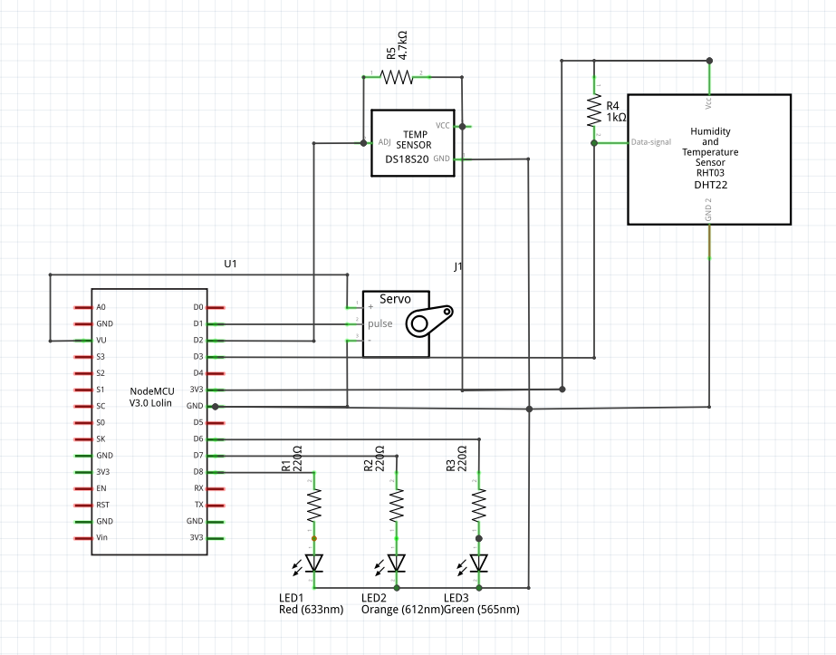
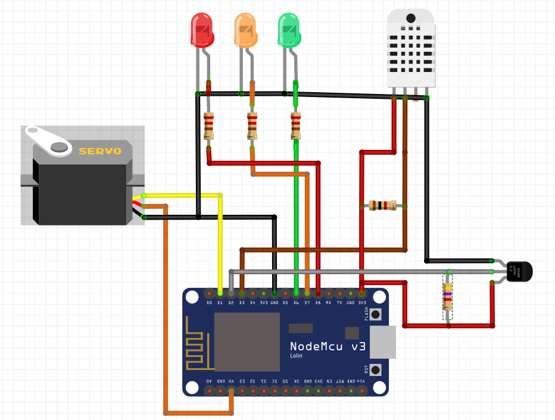
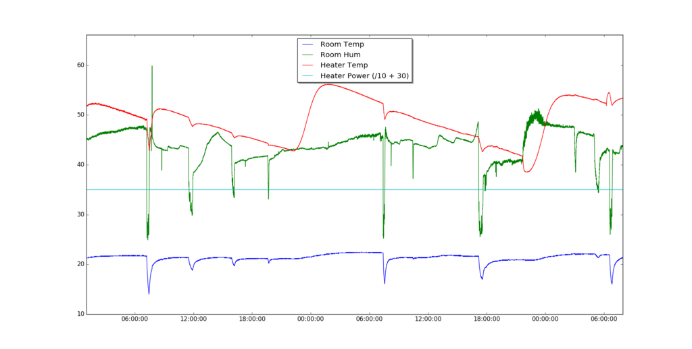

# Cosilino - Remote control Stiebel Eltron electronic heating applicances (ETS200-700) via MQTT

## Introduction

We live in an apartment fitted with these electronic heaters. They have two problems (besides
the generally bad efficency of electric heating):

1. They have one day of ineratia (they heat only at night and then keep the heat over a
   whole day). This means if the next day is unusually warm and you forget to switch them
   off the appartment is overheated the whole day. And in reverse, if you forget to switch
   them on, you have no way of "adhoc-heat".
2. The minimal setting is too hot for the transition seasons (autum, spring).

A colleague pointed me to the nice ESP8266 development board (thanks Ivan!) and with some
temperature sensors and a servo it is easy to turn this 15 year old heater into a fancy
IoT-device.

First I tried to use the DC control port which is powered by a DC current between
0.9 - 1.4 Volt , but then I ditched that idea because it would have required opening
the heater and fiddling with its internals which I didn't want to do (too risky).

The easy workaround was to just turn the max heat knob with a servo.



### Watch in action

[](https://www.youtube.com/watch?v=otGSGF0wK6k)

## cosilino-device

I built and flashed the firmware with the Arduino IDE. This folder contains the Android IDE ino-file for the device.

The device uses the WifiManager arduino lib (https://github.com/tzapu/WiFiManager).
If it cannot connect to a Wifi all LEDs will be on. You then can
connect to the devices accesspoint ( look for "cosilino-...) (... == deviceid).

You might have to adjust the mqtt server to your hostname/ip before
flashing.

    #define MQTT_SERVER "cosilino-gateway"

example for different ip:

    #define MQTT_SERVER "192.168.123.33"

### Anroid IDE plugins

I screenshotted all plugins I installed (see doc/android_ide_plugins).

### Material List

* ESP8266 (NodeMCU 1.0)
* Tower SG90 Micro Servo
* DHT-22 Temperature and Humidity-Sensor
* DS18S20 Temperature Sensor
* 1x red, 1x yellow, 1x green LEDs
* 3x 220Ohm resistor (for LEDs)
* 1x 1k Ohm resistor (pullup DHT-22)
* 1x 4,7k Ohm resistor (pullup DS18S20)
* RaspberryPi or any other permanently running pc (for MQTT broker + mongodb)

### Schematics

You find the fritzing file, schematics and plan in doc/fritzing.





## cosilino-backend

I used a raspberrypi with mosquitto and mongodb as backend.

```
apt-get install mosquitto mongodb-server
```

You might want to enable mongodb to your internal network by
commenting out

/etc/mongodb.conf

    #bind_ip = 127.0.0.1

Then restart mongodb (`/etc/init.d/mongodb restart`)


### Debugging

You can connect to all topics on the broker for debugging purposes.
`-v` also prints the topic names.

#### Read status messages

    $> mosquitto_sub -v -t "#"
    cosilino/171d45/status {"deviceId":"171d45","roomHum":51.80,"roomTemp":22.30,"heaterTemp":-127.00,"heaterPower":0}

#### Set heating level

For now I didn't implement any awesome logic. I just set up a cronjob
to switch the heater on for 1-2 hours at night. In winter it is on
all the time anyway and in summer off all the time. Of course a nice
automatic adjustment using a weather forecast would be nice (see todo).

    $> mosquitto_pub -t "cosilino/171d45/heaterpower" -m 0
    $> mosquitto_pub -t "cosilino/171d45/heaterpower" -m 100

### Pumping data into mongodb

I just run the backend in screen.

    apt-get install screen
    screen
    ./cosilino-backend.py

You might have to install an **older version of pymongo** as the mongodb version
which comes with raspbian is quite old (2.4..) .

## cosilino-mathplot

The plans to build a shiny webui were there, but for now I just built a
minimal gtk interface with mathplot lib.

You might have to install an **older version of pymongo** as the mongodb version
which comes with raspbian is quite old (2.4..) .

    ./cosilino-draw.py




## Other resources

If you are interested in learning more about the heaters specs, have a look at the manual.

https://www.stiebel-eltron.com/content/dam/ste/cdbassets/current/bedienungs-_u_installationsanleitungen/ETS_200-700__89e3d3f0-fcf7-11e6-a5ac-005056a95add.pdf


